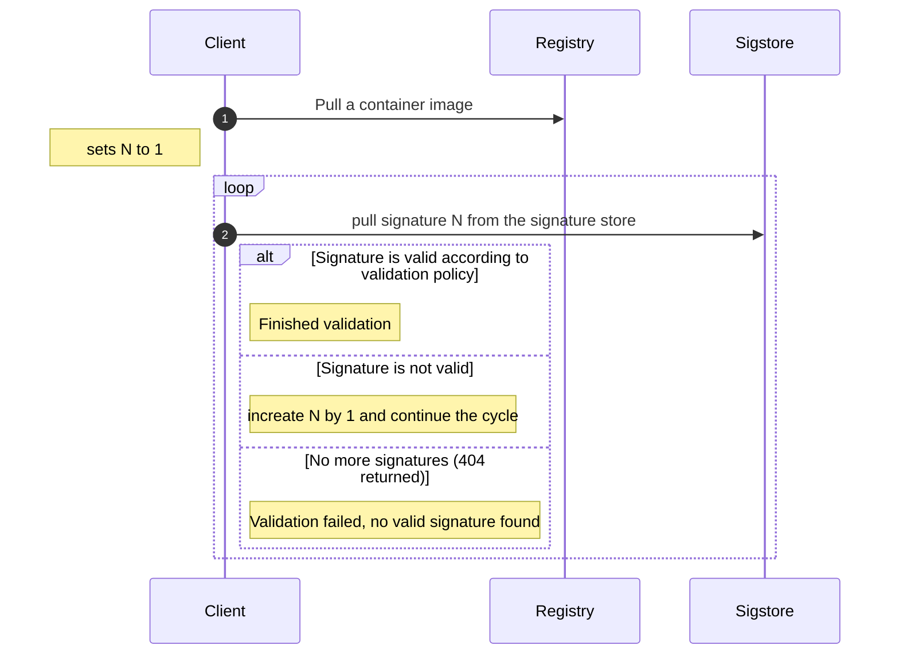

# Containers signing

## Messaging signer

Messaging signer works as client which communicates with the server via messaging bus. User data
to be signed are wrapped into signing requests and sent to the server. The server replies with 
signed requests which are composed from the original signing request and the JSON signature encrypted by
gpg and base64 encoded.
(See [Atomic signature JSON data format](https://github.com/containers/image/blob/main/docs/containers-signature.5.md#json-data-format)).

Signature then needs to be uploaded to signature store. Tooling for that is not included in this project
as it may vary depending on the signature store implementation.


### Validation

Signatures are served by sigstore via following api:
`https://sigstore.com/<any-extra-path>/<container-image-name>@sha256=<container-image-digest>/signature-<N>`
where `N` is positive integer starting from 1.
Validation of the container image is shown in the following diagram



Validation policy is defined in `/etc/containers/policy.json`. To lean more about validation policies you
can check [https://github.com/containers/image/blob/main/docs/containers-policy.json.5.md#policy-requirements].
Here's exapmle of policy.json set to validate signatures for `registry.redhat.io`
```
{
    "default": [
        {
            "type": "insecureAcceptAnything"
        }
    ],
    "transports": {
        "docker": {
            "registry.redhat.io": [
                {
                    "type": "signedBy",
                    "keyType": "GPGKeys",
                    "keyPath": "/etc/pki/rpm-gpg/RPM-GPG-KEY-redhat-release",
                    "signedIdentity": {
                        "type": "matchRepoDigestOrExact"
                    }
                }
            ]
        },
        "docker-daemon": {
            "": [
                {
                    "type": "insecureAcceptAnything"
                }
            ]
        }
    }
}
```
On top of that you need to configure the registry access in `/etc/containers/registries.d/` on client
machine.
Here's example of configuration file `registry.redhat.io.yaml`:
```yaml
docker:
  registry.redhat.io:
    sigstore: https://registry.redhat.io/containers/sigstore
```
The `sigstore` attribute is base url to the sigstore server as mentioned above `https://sigstore.com/<any-extra-path>/`.

## Example

```bash
pubtools-sign-msg-container-sign \
    --signing-key testing \
    --config-file ~/.config/pubtools-sign/conf-hacbs.yaml \
    --reference registry.redhat.io/ubi9/ubi:latest \
    --digest sha256:1d15a69724bdf0fba6fda9baaf5f3e10e562324964d0c12664f4412f549b755d \
    --task-id 32e729ee-62ae-4d17-b067-d86f6d89939f
```

## Batch signing

New type of signing request is supported for batch signing. It allows to sign multiple container images. You can specify multiple
`--reference` and `--digest` arguments which will be splitted into batches and signed with all provided signing keys.

```bash
pubtools-sign-msg-container-sign \
    --signing-key testing \
    --config-file ~/.config/pubtools-sign/conf-hacbs.yaml \
    --reference registry.redhat.io/ubi9/ubi:latest \
    --reference registry.redhat.io/ubi9/ubi:9 \
    --reference registry.redhat.io/ubi9/ubi:9.1 \
    --digest sha256:1d15a69724bdf0fba6fda9baaf5f3e10e562324964d0c12664f4412f549b755d \
    --digest sha256:1d15a69724bdf0fba6fda9baaf5f3e10e562324964d0c12664f4412f549b755d \
    --digest sha256:1d15a69724bdf0fba6fda9baaf5f3e10e562324964d0c12664f4412f549b755d \
    --task-id 32e729ee-62ae-4d17-b067-d86f6d89939f \
    --signer-type batch
```

## Cosign signer

### Validation

Validation of signatures signed by cosign can be done in two ways:

#### Cosign verify

You can use `cosign` binary to validate the signature. The command is as follows:
```bash
cosign verify <IMAGE>
```

#### Validation during podman/docker pull
You can configure registry on the client machine to use use sigstore attachements. Here's example:
```yaml
docker:
  registry.redhat.io:
    use-sigstore-attachments: true
```

