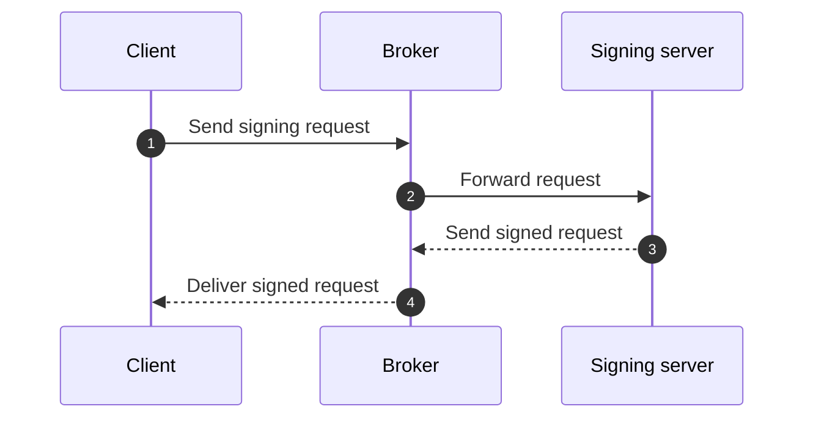
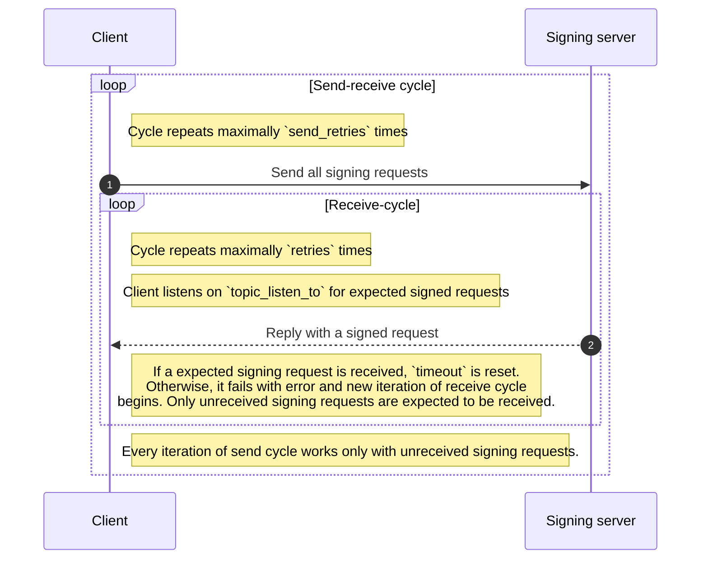

# Messaging signer details

Messaging signer sends messages over over configured messaging protocol (AMQP, MQTT, etc.) to
messaging broker. In this workflow, it's expected a signing server listens for messages on a
specific topic or queue, and processes them accordingly. See the diagram bellow

## Configuration
Messaging signer is configured in the `config.yaml` file under the `msg_signer` section. Check [[config|Configuration]] for details.
Messaging signer requires following configuration fields to be present in a configuration file:

### messaging_brokers
List of messaging brokers to connect to. It can be a list of AMQP or AMQPS. Brokers are required to be
written in fully specified url like: `amqps://<your-broker>:5671`

### messaging_cert_key
Path to a file containging certificate and key in PEM format used for authentication with the messaging broker (only for AMQPS).

### messaging_ca_cert
Path to a file containing CA certificate in PEM format used for verifying the messaging broker's certificate (only for AMQPS).

### topic_send_to
The topic where the signing requests will be sent. Example: `topic://<topic-where-you-want-to-send-signing-requests>`.

### topic_listen_to
The topic or queue where the signing server sends signed requests. This can be a queue or topic URL, such as `queue://<topic-where-signing-server-sends-signed-requests>`.
This field supports templating attributes `{creator}` and `{task_id}`. The `creator` is the UID or CN fetched from the client certificate or provided on the input by the user. The `task_id` is any user-provided string that serves to identify the message.

### environment
The environment name for which the signing requests are being processed. This is typically a unique identifier for the environment, such as `production`, `staging`, etc. This field is used in composed signigng request and its measning depends only on the signing server implementation.

### service
The ID of the service that sends the signing request. This is used to identify the service in the signing process.It depends on the signing server implementation.

### timeout
The timeout in seconds for receiving messages from the messaging broker. See the diagram bellow to  understand how it works.

### retries
The number of retries for receiving messages from the messaging broker. If a message is not received within the timeout, it will be retried this many times. See the diagram bellow to understand how it works.

### send_retries
Number of retries for repeating send-receive cycle. See the diagram bellow to understand how it works.

### message_id_key
The attribute in the signed request that identifies the request. This is used to correlate the signed request with the original signing request.

### log_level
The log level for the messaging signer. This can be set to `DEBUG`, `INFO`, `WARNING`, `ERROR`, or `CRITICAL` depending on the desired verbosity of the logs.

### key_aliases
A dictionary of key aliases that map to the real signing keys. This allows for easier management of signing keys, especially when using multiple keys for different purposes. You can also use same key for different signers.

## Messaging signer workflow of send and retries

